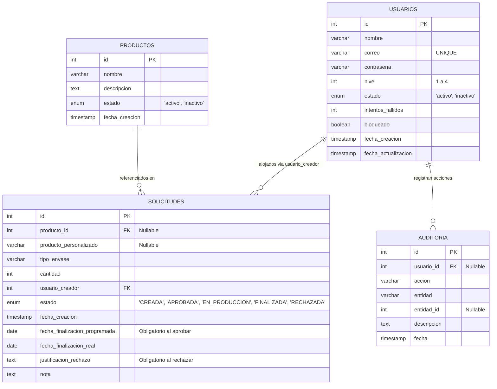

# Diagrama Entidad-Relación (ER)

```mermaid
erDiagram
    USUARIOS {
        int id PK
        varchar nombre
        varchar correo "UNIQUE"
        varchar contrasena
        int nivel "1 a 4"
        enum estado "'activo', 'inactivo'"
        int intentos_fallidos
        boolean bloqueado
        timestamp fecha_creacion
        timestamp fecha_actualizacion
    }
    
    PRODUCTOS {
        int id PK
        varchar nombre
        text descripcion
        enum estado "'activo', 'inactivo'"
        timestamp fecha_creacion
    }
    
    SOLICITUDES {
        int id PK
        int producto_id FK "Nullable"
        varchar producto_personalizado "Nullable"
        varchar tipo_envase
        int cantidad
        int usuario_creador FK
        enum estado "'CREADA', 'APROBADA', 'EN_PRODUCCION', 'FINALIZADA', 'RECHAZADA'"
        timestamp fecha_creacion
        date fecha_finalizacion_programada "Obligatorio al aprobar"
        date fecha_finalizacion_real
        text justificacion_rechazo "Obligatorio al rechazar"
        text nota
    }
    
    AUDITORIA {
        int id PK
        int usuario_id FK "Nullable"
        varchar accion
        varchar entidad
        int entidad_id "Nullable"
        text descripcion
        timestamp fecha
    }

    USUARIOS ||--o{ SOLICITUDES : "alojados via usuario_creador"
    PRODUCTOS ||--o{ SOLICITUDES : "referenciados en"
    USUARIOS ||--o{ AUDITORIA : "registran acciones"
```
